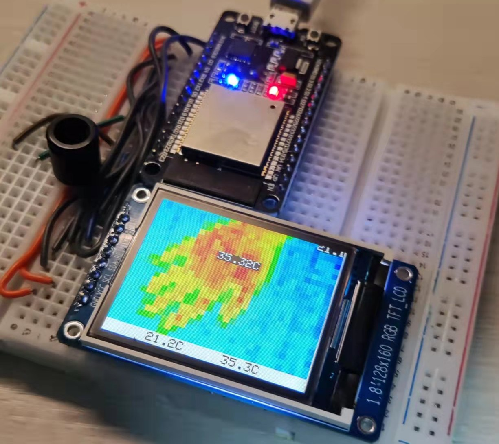

# ESP32 IR_Camera 

## Images

## Introduction

This project uses ESP32 as the MCU and then utilizes the PlatformIO plugin of VScode for development.
When using, please create a folder named `lib` in the project directory and download the libraries for MLX90640, LVGL, and TFT-eSPI.

**IR Camera Sensor:**[MLX90640](https://item.taobao.com/item.htm?id=636161415802&_u=e32soktte3a4)

**Screen:**[1.8 inch TFT ](https://item.taobao.com/item.htm?spm=a1z09.2.0.0.1dcb2e8dtwKYFF&id=565272507619&_u=e32soktt9b84)

